

  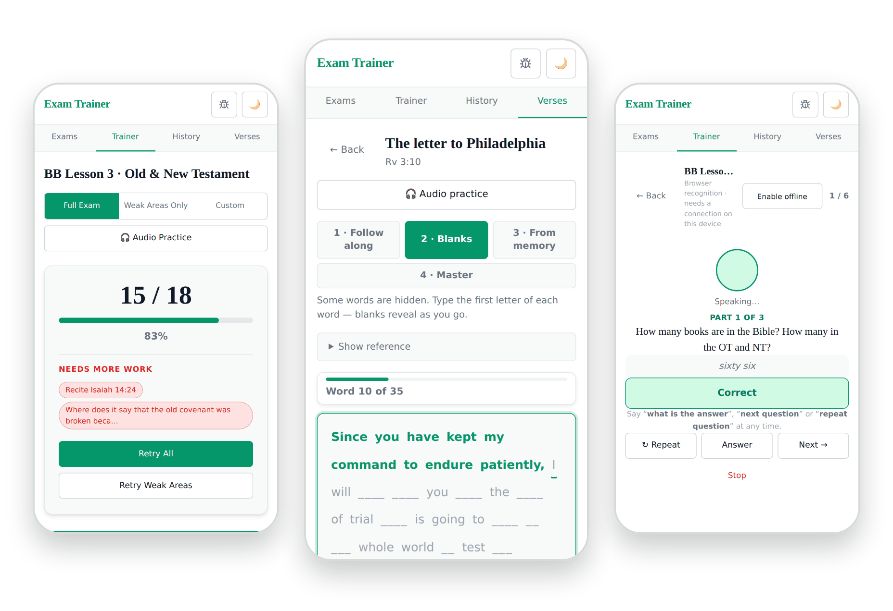

<h1 align="center">Exam Trainer — the guide</h1>

  <em>Write the answer out, mark it honestly, and practise the bits you keep getting wrong — 
  on a phone, in a tunnel, with no account and no connection.</em>

---

Exam Trainer is a study app for exams you have to **answer**, not exams you have to
recognise: you type the answer, say it out loud, or spell a verse a letter at a time.
It is a single static web page. Everything you make lives on your own device, and
almost everything it does works with aeroplane mode on (the one exception is under
[Audio practice](#audio-practice)).

This guide is the long version. If you just want to get going, read
[Five minutes in](#five-minutes-in) and come back.

**Contents**

- [The idea](#the-idea)
- [The four tabs](#the-four-tabs)
- [Five minutes in](#five-minutes-in)
- [Exams — building the question bank](#exams--building-the-question-bank)
- [Trainer — the practice session](#trainer--the-practice-session)
- [Audio practice](#audio-practice)
- [History — what you actually know](#history--what-you-actually-know)
- [Verses — the first-letter method](#verses--the-first-letter-method)
- [Your data](#your-data)
- [Installing and offline](#installing-and-offline)
- [When something goes wrong](#when-something-goes-wrong)
- [Reference](#reference)

---

## The idea

Six decisions shape everything else in the app. They are worth knowing, because a
couple of them look like missing features until you see what they are for.

**Recall, not recognition.** There is no multiple choice anywhere in Exam Trainer,
and there never will be. Picking the right answer out of four is a different and much
easier skill than producing it from nothing, and the exam asks for the second one.
Every answer here is typed, spoken, or spelled out.

**Marking is part of the studying.** The typed grader forgives case, punctuation and
a small typo — enough to stop a stray comma costing you a mark, not enough to be a
judge of a paragraph-long answer. That is what **Submit & Mark** is for: it puts your
answer next to the real one and asks *you* whether it counts. Reading the two side by
side is where a lot of the learning happens, and it is the only honest way to mark
prose.

**Your wrong answers are the index.** Every attempt is stored per sub-question, so
the app can hand back precisely the parts you keep missing — a whole-question **Weak
Areas** mode, and inside it, *only the sub-questions you got wrong*. There is no
clever scheduling algorithm here. It is your own misses, replayed until they stop
being misses.

**Study happens in the gaps.** The layout is built for a phone held in one hand: big
targets, one column, and a submit bar that sits at the end of the page rather than
covering what you are reading. For the times your hands and eyes are busy but your
mouth and ears are free, [Audio practice](#audio-practice) runs the whole session by
voice.

**Your data is a file, not an account.** No sign-in, no server, no sync. Exams and
verses live in your browser's own storage and travel as plain JSON you can read,
email, diff or keep in a folder. Nothing can be taken away from you by a shutdown
notice.

**A verse is a different problem.** Recalling a passage word-for-word is not a
question-and-answer task, so the Verses tab uses the first-letter method instead, with
four levels that take the text away a piece at a time.

---

## The four tabs

<table>
  <tr>
    <td align="center">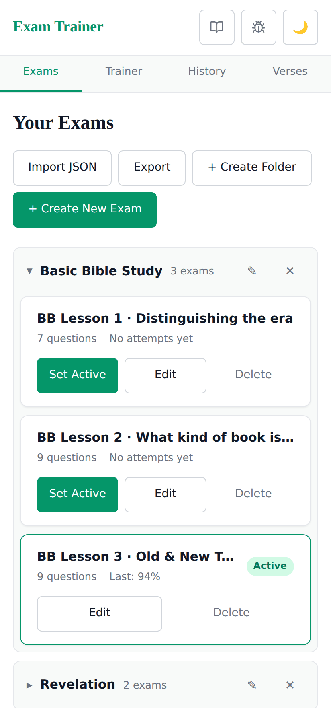</td>
    <td align="center">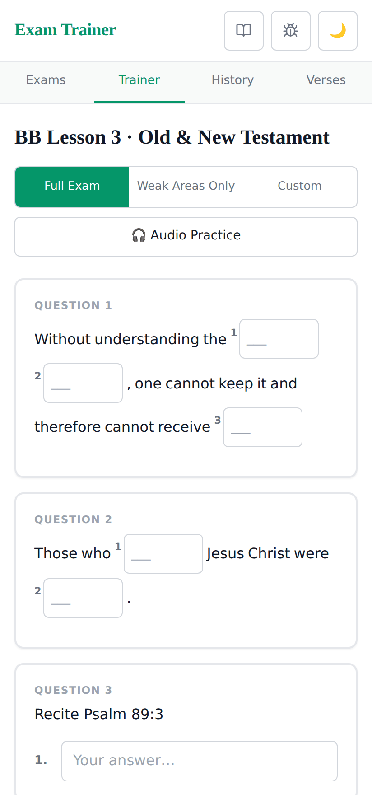</td>
    <td align="center">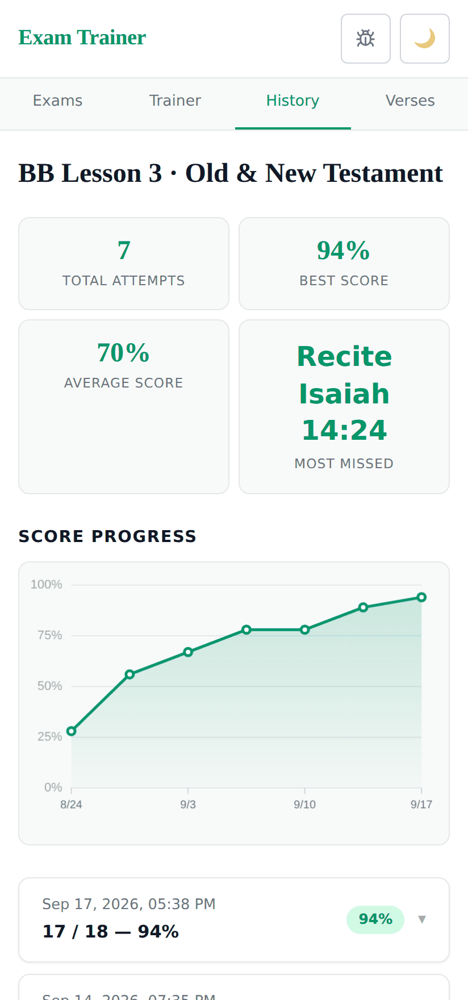</td>
    <td align="center">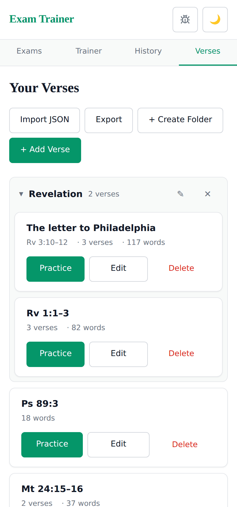</td>
  </tr>
  <tr>
    <td align="center"><b>Exams</b></td>
    <td align="center"><b>Trainer</b></td>
    <td align="center"><b>History</b></td>
    <td align="center"><b>Verses</b></td>
  </tr>
  <tr>
    <td valign="top">Your question banks. Import, write, file into folders, export.</td>
    <td valign="top">The session itself: answer, submit, mark, retry.</td>
    <td valign="top">Every attempt at the active exam, and what it says about you.</td>
    <td valign="top">Passages to memorise, with their own trainer.</td>
  </tr>
</table>

Exams, Trainer and History all turn on **one active exam** at a time: the Exams tab
picks it, the Trainer practises it, History reports on it. Verses is its own world and
ignores all that. Above the tabs sit a 🐛 button
([bug reports](#when-something-goes-wrong)) and a 🌙/☀️ toggle — dark mode is a real
theme, not an inverted screen, and every view has one.

<table>
  <tr>
    <td align="center">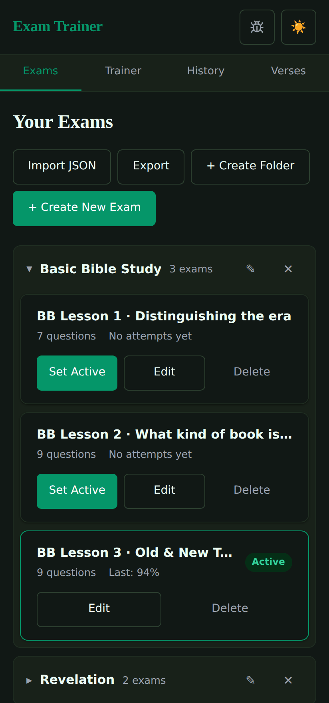</td>
    <td align="center">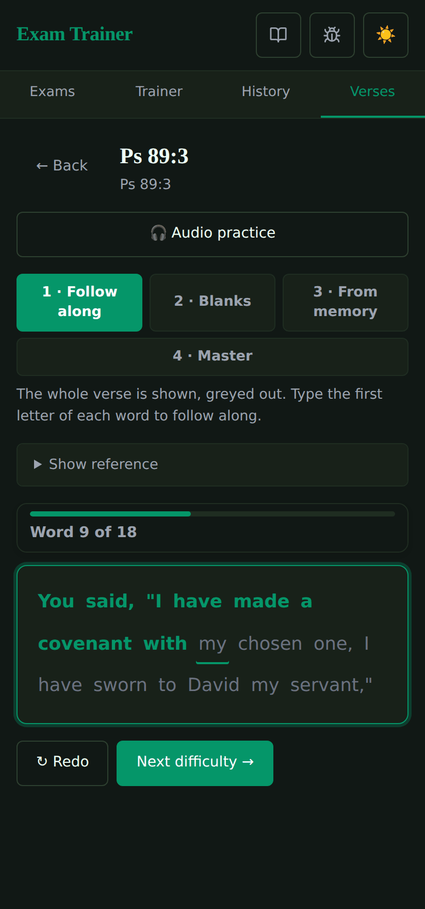</td>
  </tr>
  <tr>
    <td align="center" colspan="2"><em>Reading in bed without being shouted at</em></td>
  </tr>
</table>

---

## Five minutes in

1. **Open the app** at its address and — on Android or desktop Chrome — use *Add to
   Home screen* / *Install*. It then opens like any other app and works offline.
2. **Get some questions in.** Either **Import JSON** (a file of questions — see
   [the format](../import-format.md)) or **+ Create New Exam** and type a few in.
3. Press **Set Active** on that exam.
4. **Go to Trainer.** Answer what you can, leave the rest blank, and press **Submit**.
   Nothing is lost by scoring badly — the first attempt is what tells the app which
   questions to bring back.
5. **Go to History** to see the attempt, then back to Trainer and switch to **Weak
   Areas Only**. From here on, that is the mode you will live in.

---

## Exams — building the question bank

<table>
  <tr>
    <td align="center"></td>
    <td align="center">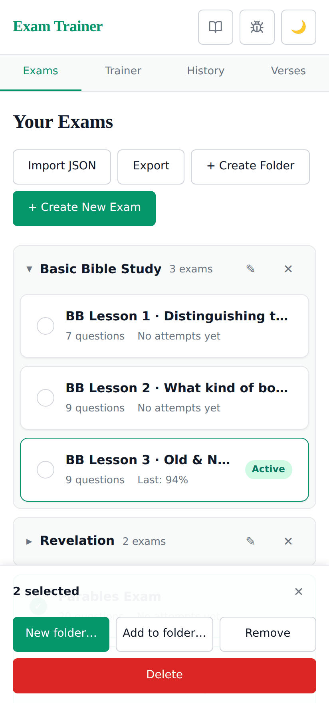</td>
    <td align="center">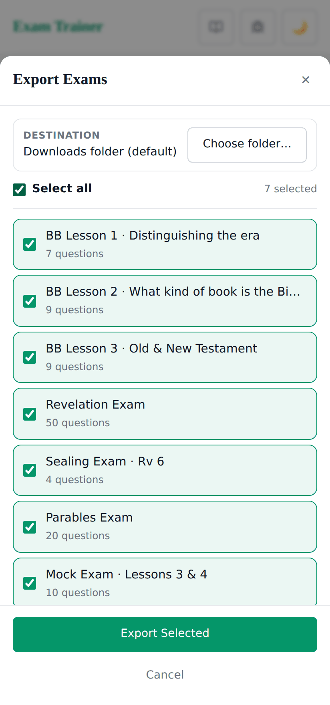</td>
  </tr>
  <tr>
    <td align="center"><em>The list, with one exam active</em></td>
    <td align="center"><em>Long-press to select several</em></td>
    <td align="center"><em>Export writes one JSON per exam</em></td>
  </tr>
</table>

Each card shows how many questions the exam holds and how the last attempt went. The
green **Active** badge marks the one the Trainer and History are pointed at; tap
**Set Active** on any other card to move them.

**Folders.** *+ Create Folder* makes a collapsible section. To file things into it,
**press and hold** any card for a moment — the list flips into selection mode, and the
bar along the bottom can move the selected exams into a new or existing folder, take
them out again, or delete them together. Deleting a *folder* never deletes what is
inside it; the exams just move back out.

**Import.** *Import JSON* takes one or several `.json` files at once. Each file
becomes one exam, named after the file. The format is a plain array of
`{ question, correct }` objects and is documented in
[`import-format.md`](../import-format.md) — with multi-part answers, blanks, and the
mistakes that are easy to make.

**Export.** *Export* writes one `.json` per exam, to the Downloads folder by default.
On a desktop browser that supports it, *Choose folder…* writes straight into a folder
you pick — handy for keeping a study folder in sync, or for putting the files
somewhere you back up.

### Writing questions

<table>
  <tr>
    <td align="center">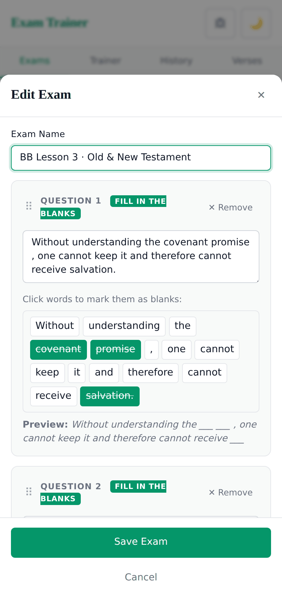</td>
    <td align="center">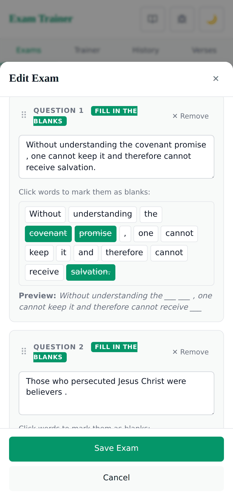</td>
    <td align="center">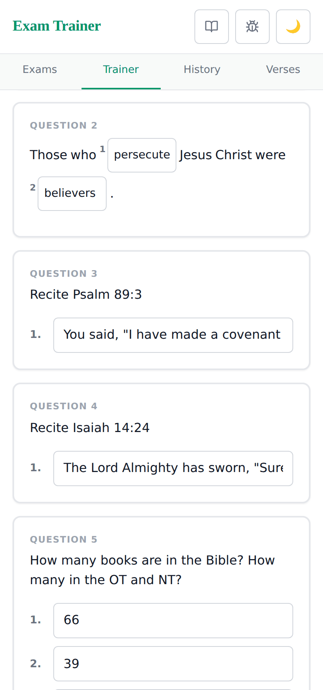</td>
  </tr>
  <tr>
    <td align="center"><em>One row per question, drag to reorder</em></td>
    <td align="center"><em>Tap a word to make it a blank</em></td>
    <td align="center"><em>How both kinds look in practice</em></td>
  </tr>
</table>

*+ Create New Exam* (or *Edit* on a card) opens the editor. Two kinds of question:

**A normal question** has question text and one or more answer parts. Use several
parts whenever the question really asks for several things — *"How many books are in
the Bible? How many in the OT and NT?"* is three parts, not one. Parts are marked
independently, they are counted separately in your score, and — this is the point —
they can be drilled separately later.

**Fill in the Blanks** takes a whole sentence and lets you tap the words that should
become blanks. The preview underneath shows what you will see in the session. In the
Trainer the blanks appear inline, in the sentence, which is a much better test of a
memorised line than the same words in a list.

On a computer, the handle (⠿) on each row drags questions into a different order; on a
phone the handle is decorative, so put questions in the order you want them as you go.
If you close the editor by accident — or the phone closes the tab on you — the unsaved
draft is kept and put back the next time you open the same exam.

---

## Trainer — the practice session

The Trainer always practises the active exam. What it puts in front of you is decided
by the three modes at the top.

<table>
  <tr>
    <td align="center"></td>
    <td align="center">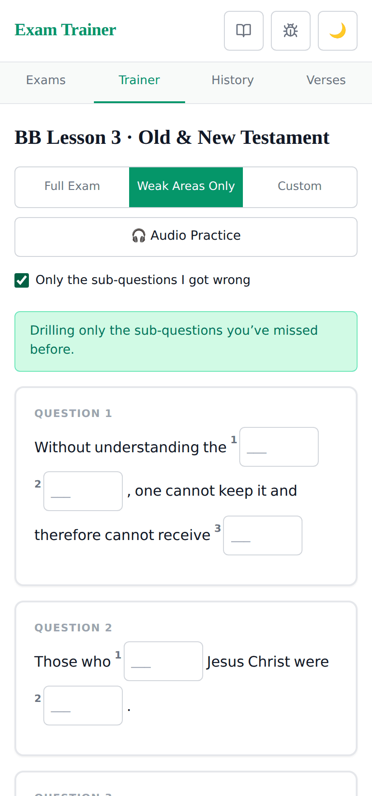</td>
    <td align="center">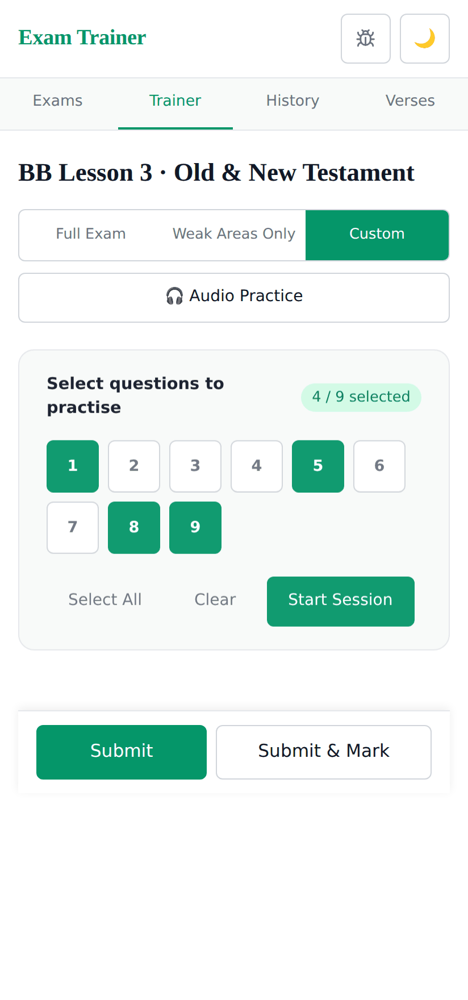</td>
  </tr>
  <tr>
    <td align="center"><b>Full Exam</b> <em>Everything, in order</em></td>
    <td align="center"><b>Weak Areas Only</b> <em>Only what you have missed</em></td>
    <td align="center"><b>Custom</b> <em>Whichever you point at</em></td>
  </tr>
</table>

**Full Exam** is the whole bank — the mock-exam sitting.

**Weak Areas Only** is every question you have ever missed a part of, in exam order.
(With no attempts recorded yet it quietly shows the full exam and says so.) The
checkbox underneath, **Only the sub-questions I got wrong**, narrows it further: a
question you got two parts out of three right on will ask you only for the third.
Questions whose answers sit inline in a sentence are left whole — a sentence with
holes in it only makes sense entire.

**Custom** opens a grid of question numbers, everything selected to begin with. Tap a
number to drop it, drag across several to paint a range, or *Clear* and pick the few
you want — then *Start Session*. Good for "the ten I was shaky on last night".

### Answering, submitting, marking

<table>
  <tr>
    <td align="center">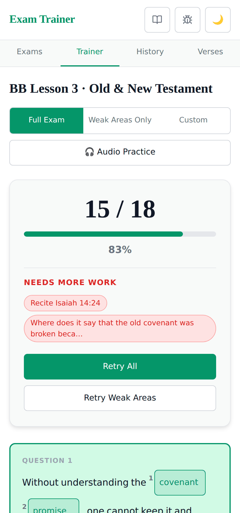</td>
    <td align="center">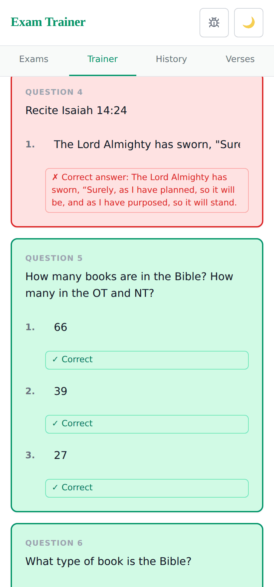</td>
    <td align="center">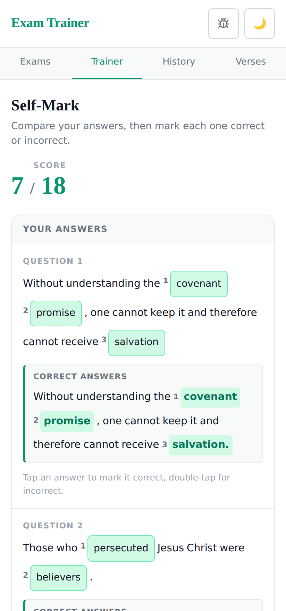</td>
  </tr>
  <tr>
    <td align="center"><em>Score, and what needs work</em></td>
    <td align="center"><em>Every part marked, with the real answer</em></td>
    <td align="center"><em>Submit &amp; Mark hands it to you</em></td>
  </tr>
</table>

Type into the boxes — one per answer part, or into the blanks where they sit in the
sentence. Then pick one of two buttons at the end of the page:

**Submit** marks it for you. Each part is compared with the stored answer after
lower-casing it, stripping punctuation and dashes, and collapsing whitespace; a
difference of up to about 10% of the answer's length is forgiven as a typo. Cards turn
**green** (every part right), **amber** (some) or **red** (none), each part gets a
✓ or the real answer, and the inputs lock.

> **Where the tolerance bites.** The typo allowance never drops below one character,
> so on a very short answer — a number, a year, `27` — a one-character miss still
> passes. When the exact characters are the thing being tested, mark it yourself.

**Submit & Mark** shows you the self-mark screen instead: your answer, the correct
answer beside it, and a ✓/✗ for each part. For questions written as a sentence with
blanks, you tap the answer itself — once for correct, twice for incorrect. The running
score is in the corner. **Anything you leave unmarked counts as wrong**, so a quick
pass down the ✓ column is all a good sitting needs. *Cancel* backs out and records
nothing.

<table>
  <tr>
    <td align="center">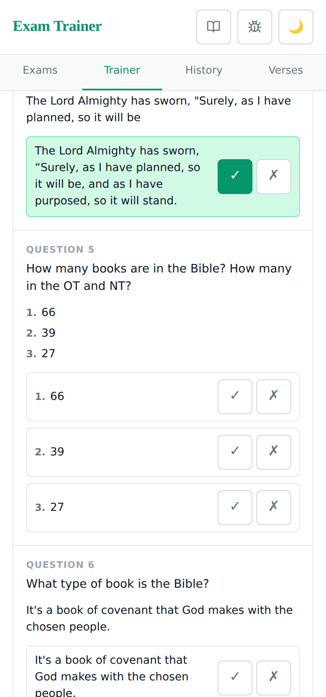</td>
    <td align="center">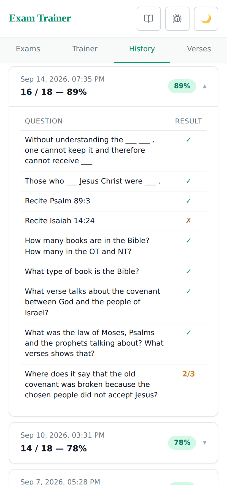</td>
  </tr>
  <tr>
    <td align="center"><em>Each part is marked on its own</em></td>
    <td align="center"><em>…and kept, part by part</em></td>
  </tr>
</table>

Either way the attempt is written to History, and the **results panel** slides in at
the top: score, percentage, and a **Needs More Work** list. Those entries are links —
tap one to jump straight to that card and read the answer you missed. **Retry All**
and **Retry Weak Areas** start the next round without leaving the tab.

---

## Audio practice

<table>
  <tr>
    <td align="center">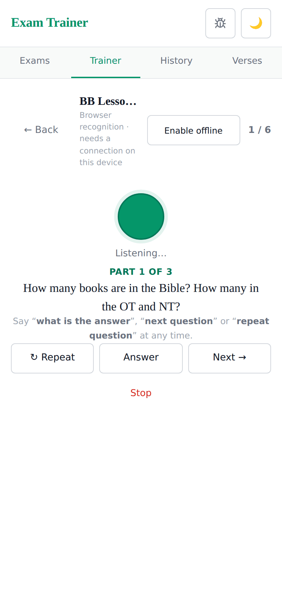</td>
    <td align="center">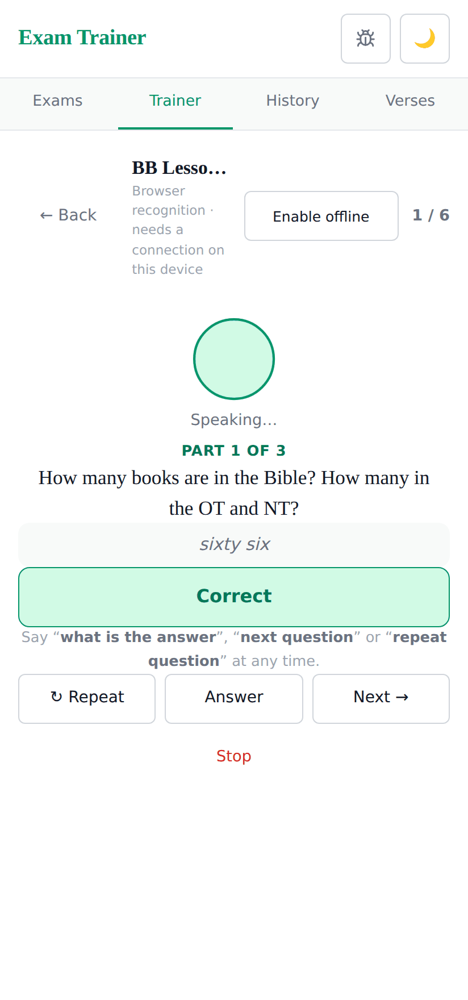</td>
    <td align="center">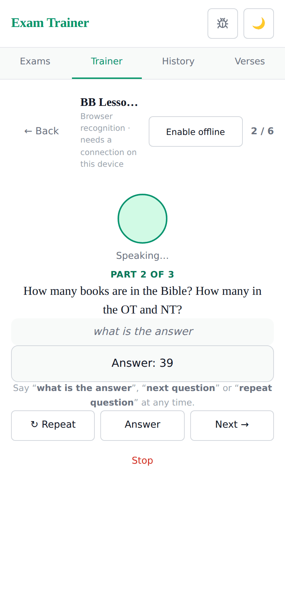</td>
    <td align="center">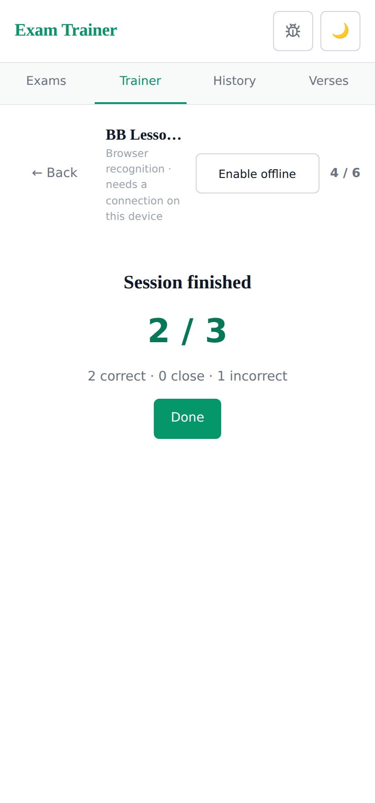</td>
  </tr>
  <tr>
    <td align="center"><em>It asks, then listens</em></td>
    <td align="center"><em>What it heard, and the verdict</em></td>
    <td align="center"><em>"What is the answer"</em></td>
    <td align="center"><em>How the session went</em></td>
  </tr>
</table>

The **🎧 Audio Practice** button next to the mode toggle runs the same session with no
hands and no screen. The app reads a question, listens for your answer, says whether
it was right, and reads the real answer back. Multi-part questions are asked a part at
a time, so you are never trying to hold three answers in your head at once. It
practises whatever the mode selects, so Weak Areas and Custom carry over.

While it is listening you can say:

| Say | It does |
|---|---|
| "what is the answer" — or "I don't know", or "pass" | Reads the answer out without marking the question |
| "next question" / "skip" / "move on" | Moves on — skipped, not failed |
| "repeat question" / "say again" | Asks again |
| "stop" / "end session" / "I'm done" | Ends the session and shows the score |

The same four are on screen as buttons, for a glance at a red light. Silence never
advances anything: after twenty quiet seconds it offers the options once and carries
on listening, because thinking time is the whole point.

**How spoken answers are marked.** Not by exact wording — speech gets the words right
and the phrasing wrong. What counts is how much of the real answer's *content* came
back, so saying it in your own words passes. Scripture references are matched by
meaning, so "revelation three twelve" answers `Rv 3:12`, and they are read back
expanded ("Matthew 17 verse 27") rather than spelled as written. A near miss is called
**close**: it reads the answer back to you, and it does not count as correct.

**Audio results are deliberately not written to History.** They are speech-graded, and
letting them feed Weak Areas would quietly change what the typed Practice mode shows
you. The end-of-session card is the score; it goes no further.

### Making it work in a tunnel

Reading aloud is done on the device and works offline. **Listening is the part that
needs setting up**, and the session header always says which recogniser you are on.

| | Works offline | Setup |
|---|---|---|
| **Browser recognition** (default) | Only on desktop Chrome 139+ | None |
| **Offline recognition** (Vosk) | Yes, everywhere | One 39 MB download |

The browser's own recogniser is the more accurate of the two, but on Android it sends
audio to Google — so underground it simply stops working. To close that gap: **start
an audio session while you still have signal and tap *Enable offline* in the header.**
That fetches a small English speech model once, keeps it on the device, and uses it
from the next session on. Expect slightly lower accuracy in exchange for a session
that does not care where you are.

If that model is ever missing or damaged, the session quietly falls back to the
browser recogniser and tells you, rather than failing.

> Speech recognition needs Chrome (desktop or Android). iOS has no Web Speech
> recognition in any browser, so audio practice cannot listen there — reading aloud
> and the verse audio mode still work.

---

## History — what you actually know

<table>
  <tr>
    <td align="center"></td>
    <td align="center">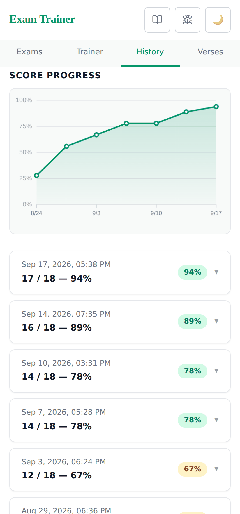</td>
    <td align="center"></td>
  </tr>
  <tr>
    <td align="center"><em>Four numbers, including the one that stings</em></td>
    <td align="center"><em>Every attempt, in order</em></td>
    <td align="center"><em>Tap an attempt to open it up</em></td>
  </tr>
</table>

History reports on the **active exam** only. At the top: total attempts, best score,
average score, and the question you have missed most often — which is usually the most
useful line on the screen. Under that, every attempt plotted in order, so a plateau
looks like a plateau.

Each attempt in the list expands into the full paper: every question, what you wrote,
what the answer was, and whether it counted. Multi-part questions show as `2/3` when
you got some of them. This is also the record Weak Areas is built from.

**Clear History** wipes the attempts for this exam only. Other exams keep theirs. Note
that a *re-imported* exam is a new exam as far as the app is concerned, and starts
with a clean record.

---

## Verses — the first-letter method

<table>
  <tr>
    <td align="center"></td>
    <td align="center">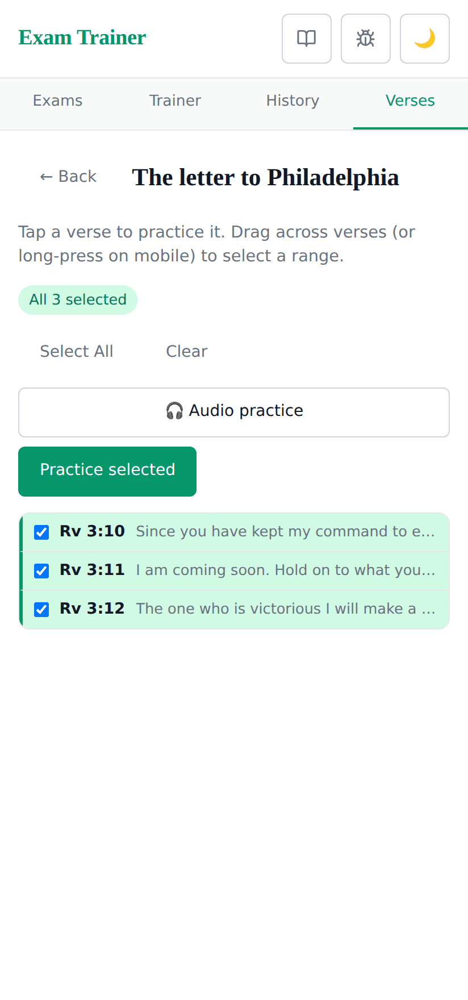</td>
    <td align="center">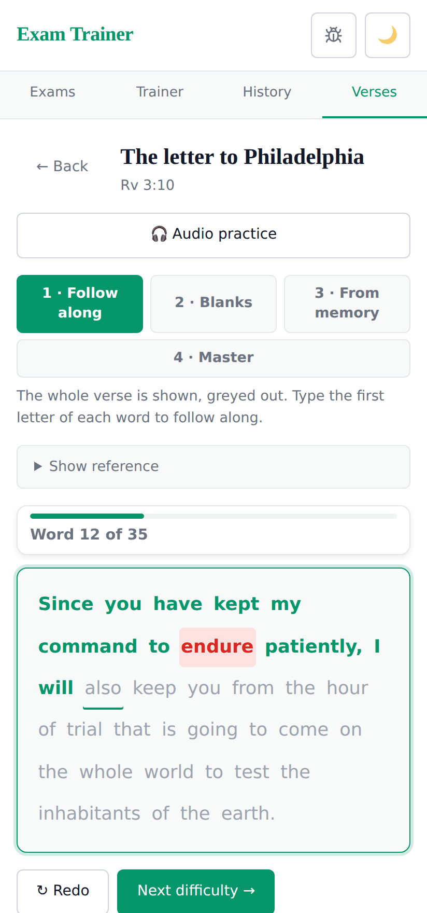</td>
  </tr>
  <tr>
    <td align="center"><em>Entries, foldered like exams</em></td>
    <td align="center"><em>Tap one verse, or practise a passage</em></td>
    <td align="center"><em>Green for right, red for wrong</em></td>
  </tr>
</table>

A verse **entry** holds one or more verses — a single line, or a passage you want to
be able to run through back to back. Add them by hand with *+ Add Verse*, or import a
`.json` file of `{ ref, text }` items ([format](../import-format.md)). Entries live in
folders and export the same way exams do.

Opening an entry with several verses first asks what you want: **tap one verse** to
practise it alone — *Previous verse* / *Next verse* then walk you through the rest one
at a time — or tick a range (long-press and drag to sweep across several) and
**Practice selected** to drill them as one continuous passage.

Then you type **the first letter of every word**. That is the whole method: enough of
the text to prove you have it, little enough to be quick, and — crucially — possible
on a phone keyboard on a moving bus. Right letters turn the word green and reveal it,
wrong ones turn it red and move on anyway; backspace steps back a word. The sticky bar
shows how far through you are, then your score.

### The four levels

<table>
  <tr>
    <td align="center">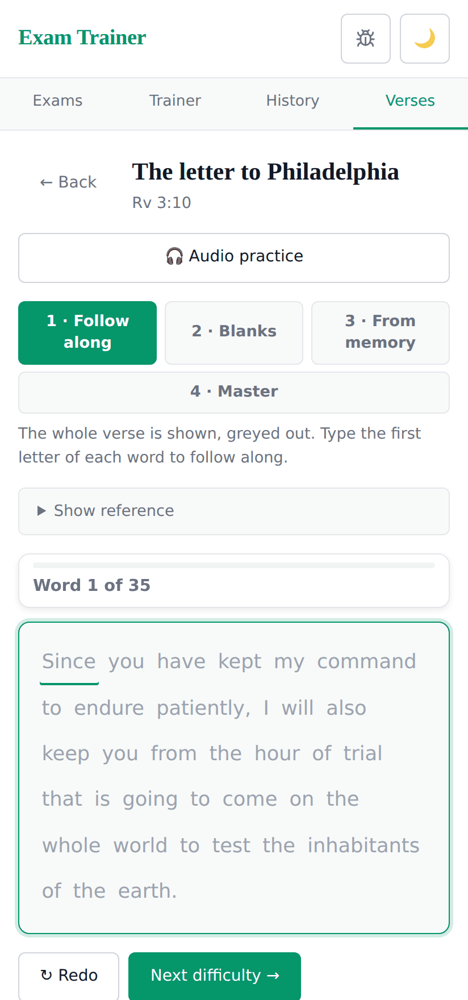</td>
    <td align="center">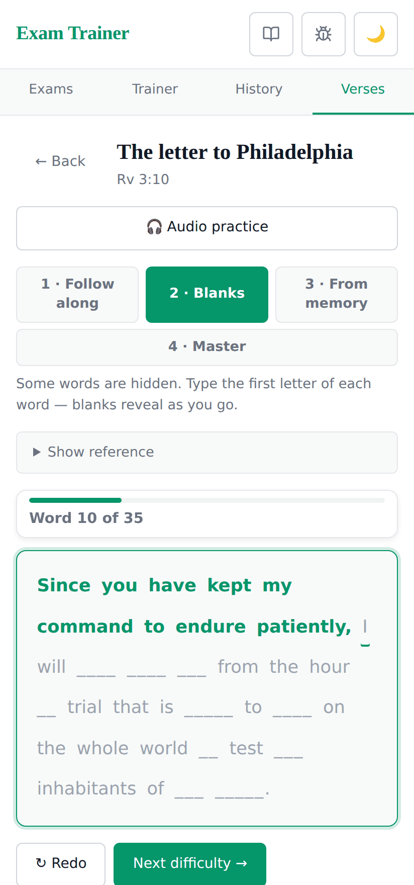</td>
    <td align="center">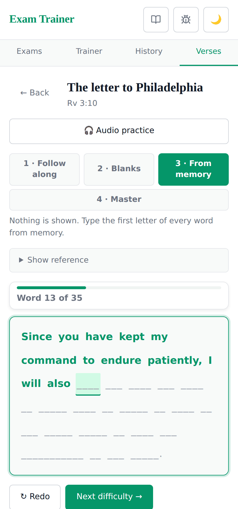</td>
    <td align="center">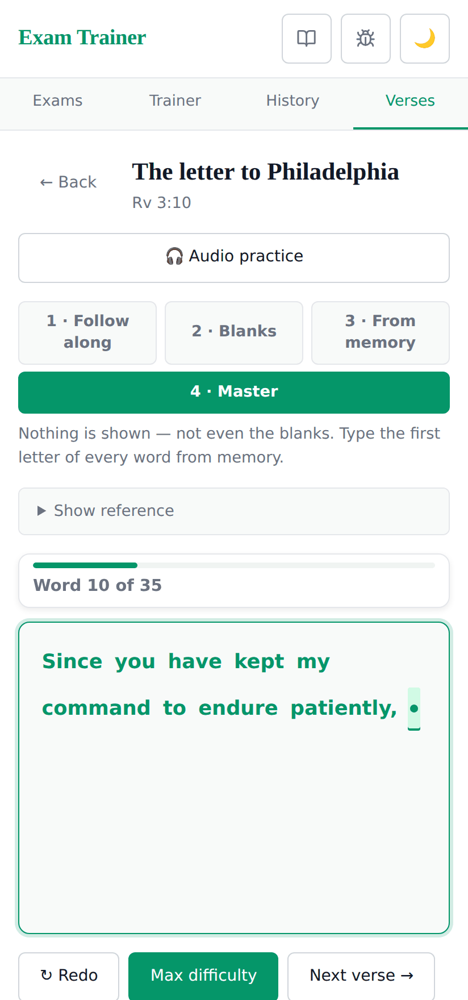</td>
  </tr>
  <tr>
    <td align="center"><b>1 · Follow along</b></td>
    <td align="center"><b>2 · Blanks</b></td>
    <td align="center"><b>3 · From memory</b></td>
    <td align="center"><b>4 · Master</b></td>
  </tr>
  <tr>
    <td valign="top">The whole verse is there, greyed out. You are learning the shape of it.</td>
    <td valign="top">Four words in ten are hidden, chosen afresh each run.</td>
    <td valign="top">Nothing is shown. The blanks still show you where the words are, and how long.</td>
    <td valign="top">Not even that: no word lengths, no punctuation, just a dot where you are.</td>
  </tr>
</table>

Each word is revealed as you reach it, so a level is always survivable — you find out
what you had forgotten immediately, in place, rather than at the end. *Redo* re-runs
the level (with new blanks at level 2); *Next difficulty* moves up.

**Show reference** quietly opens the full text when you are stuck, and closes again.

On a desktop keyboard: <kbd>←</kbd>/<kbd>→</kbd> page between verses,
<kbd>Shift</kbd>+<kbd>←</kbd>/<kbd>→</kbd> change difficulty, and
<kbd>Shift</kbd>+<kbd>R</kbd> redoes the level.

### Listening to a passage

  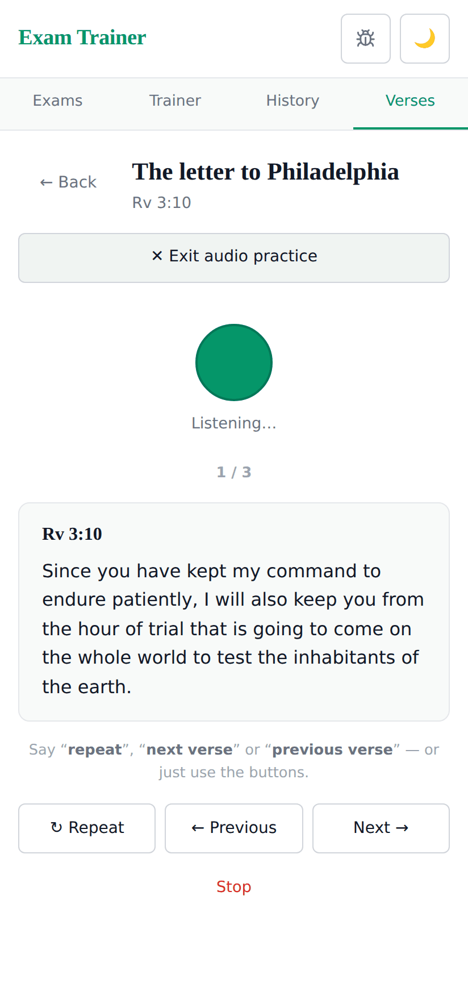

**🎧 Audio practice** in a verse session reads the passage aloud and pages through it
— say "repeat", "next verse", "previous verse" or "stop", or use the buttons, which
always work even where speech recognition does not. There is no grading here and no
microphone marking: it is for the walk, the washing-up, and the last look before bed.

---

## Your data

Everything you create is kept in your browser's local storage, on that device, under
that browser. There is no account and nothing is uploaded. That has two consequences
worth being clear-eyed about:

- **Clearing site data for the app deletes it.** So does an aggressive "clean up
  storage" tool. Export anything you would be sorry to lose.
- **Devices do not sync.** Moving to a new phone means exporting on the old one and
  importing on the new one — which is a file copy, and takes a minute.

Import and export are per-file JSON, documented in
[`import-format.md`](../import-format.md): a top-level array of questions, or of
`{ ref, text }` verses. Exported files re-import cleanly, blanks included.

### What leaves the device

Being honest about the exceptions, because "offline app" is a claim people make
loosely:

| | What goes out |
|---|---|
| Your exams, verses, answers, history | **Nothing. Ever.** None of it is sent anywhere. |
| Web fonts | The page asks Google Fonts for two fonts on first load, then caches them. |
| Audio practice on Android | The browser recogniser sends audio to Google. Enabling offline recognition stops that. |
| Bug reports | Only what you typed, plus version and browser details, and only when you press *Open on GitHub* — and only then. |

---

## Installing and offline

Exam Trainer is a Progressive Web App. On Android or desktop Chrome, *Install* / *Add
to Home screen* gives it its own icon and window, with no browser chrome; on iOS,
*Share → Add to Home Screen* does the same. After the first load, the app runs with no
connection at all: the page, the styles, the code and your data are all local.

Updates arrive by themselves. When the app is opened online it fetches the current
release, so you are never a version behind; offline, it falls back to the copy on the
device. The Android back gesture behaves the way it should, too — it closes the open
sheet or session first, and only leaves the app when there is nothing left to close.

---

## When something goes wrong

  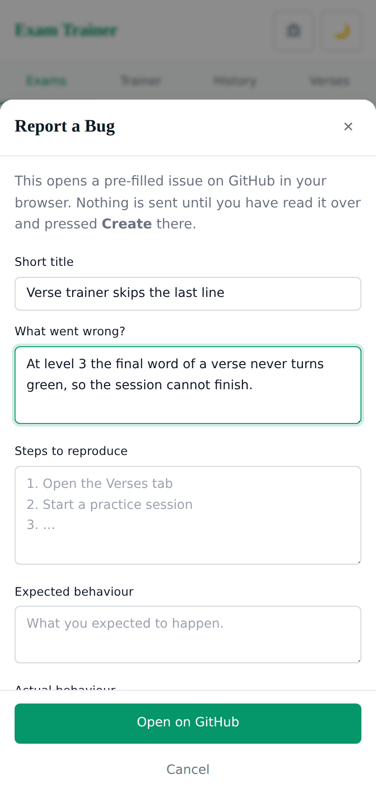

The 🐛 button in the header writes the report for you: a title, what happened, the
steps, and what you expected. It attaches the running build, the browser and the
device — which you can read before you send, under *Diagnostics attached to the
report* — and then opens GitHub's new-issue page with all of it filled in.

No issue is filed until you have read the whole thing over and pressed **Create** on
GitHub — and no exam content, no verses, no history and nothing that identifies you is
attached to it.

---

## Reference

### Keyboard shortcuts

| Key | Where | Does |
|---|---|---|
| <kbd>←</kbd> / <kbd>→</kbd> | Verse practice | Previous / next verse in the entry |
| <kbd>Shift</kbd> + <kbd>←</kbd> / <kbd>→</kbd> | Verse practice | Lower / raise the difficulty level |
| <kbd>Shift</kbd> + <kbd>R</kbd> | Verse practice | Redo the current level |
| <kbd>Backspace</kbd> | Verse practice | Step back one word |

### How answers are marked

| | Typed (Trainer) | Spoken (Audio practice) |
|---|---|---|
| Case, punctuation, extra spaces | Ignored | Ignored |
| Wording | Must match, ±10% of the length as typos | Judged on content, not phrasing |
| Numbers | As written | "sixty six" = `66` |
| References | Compared as text | Matched by meaning; `Rv 3:12` ≠ `Rv 3:13` |
| Multi-part questions | Each part scored on its own | Asked and marked a part at a time |
| Near miss | Not a thing — right or wrong | Called **close**: reads the answer back, scores nothing |
| Recorded in History | Yes | No |

### Where things are kept

| What | Where |
|---|---|
| Exams, verses, folders, attempt history, theme | Browser local storage |
| The offline speech model (39 MB) | Its own cache entry, kept across app updates |
| The app itself | Service worker cache, refreshed on each online launch |

---

  Built as a personal study tool. Bugs and ideas: the 🐛 button, or the repository's issues.

